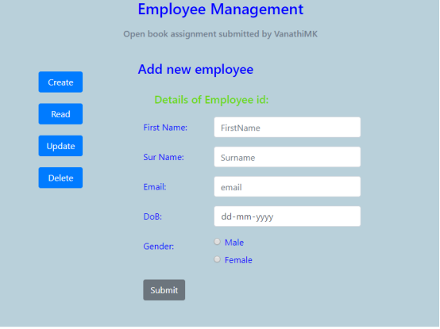
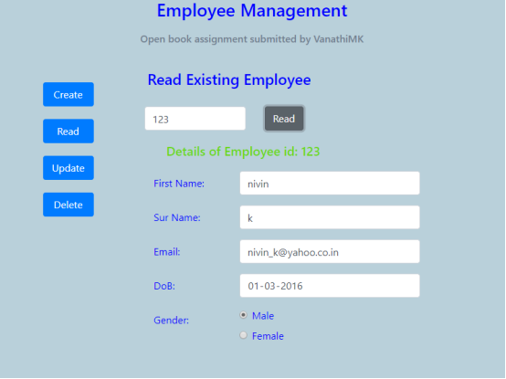
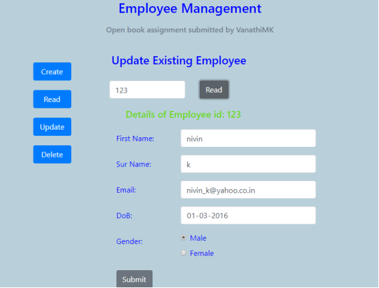
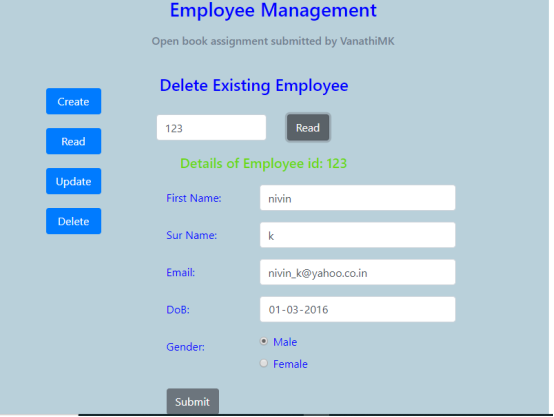

## **Employee Management System : Front End**

### **Steps to run the system**

 1. Import the ems project.

2.	Default port is set to 3000 (Open package.json and change to desired port in scripts part).

3.	Open Command Prompt and navigate to project folder and start the project.

		cd ems/ems-react

		npm start

4. Hit the below url in browser:

     [**http://localhost:3000**](http://localhost:3000)

**Below are the screenshots:**
**Home Page:**

Create Employee:

Read Employee:

UpdateEmployee:

Delete Employee:

